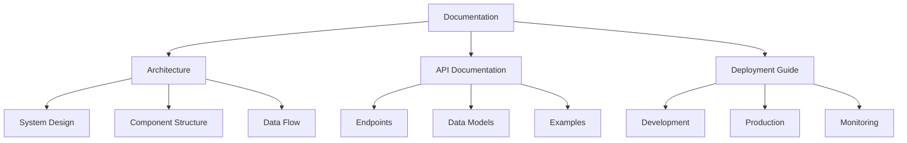
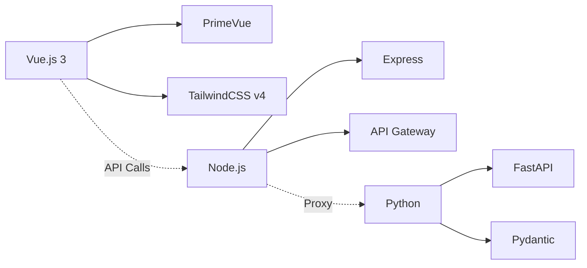
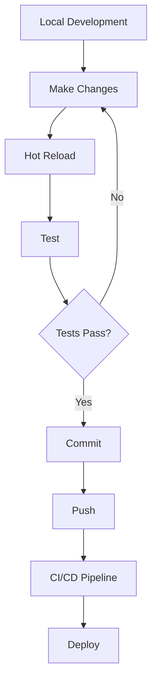

# Dashboard Documentation

Welcome to the comprehensive documentation for the Vue.js + Node.js + FastAPI dashboard application.

## Documentation Structure



## Quick Links

### 📐 [Architecture Documentation](./architecture.md)
Comprehensive overview of the system architecture including:
- System architecture diagrams
- Request flow sequences
- Component relationships
- Technology stack details
- Design patterns

### 🔌 [API Documentation](./api-documentation.md)
Complete API reference including:
- Endpoint specifications
- Request/response examples
- Error handling
- Data models
- Authentication (future)

### 🚀 [Deployment Guide](./deployment-guide.md)
Step-by-step deployment instructions for:
- Development setup
- Production deployment
- Cloud platform deployment
- Monitoring and maintenance
- Security best practices

## System Overview

This is a modern full-stack dashboard application built with:



### Key Features

- **Modern UI**: Built with Vue.js 3, PrimeVue components, and TailwindCSS v4
- **API Gateway**: Node.js middleware for request routing and security
- **Fast Backend**: Python FastAPI for high-performance data processing
- **Real-time Updates**: WebSocket support (planned)
- **Scalable Architecture**: Microservices-ready design
- **Security First**: Rate limiting, CORS, and security headers

## Getting Started

### Prerequisites

- Node.js 20+ and npm
- Python 3.11+
- Docker and Docker Compose (optional)

### Quick Start

```bash
# Clone the repository
git clone <repository-url>
cd vite-tailwindv4

# Using Docker (recommended)
docker-compose up --build

# Or manual setup - see Deployment Guide
```

### Access Points

- Frontend: http://localhost:5173
- API Gateway: http://localhost:3001
- Backend API: http://localhost:8000
- API Documentation: http://localhost:8000/docs

## Development Workflow



## Contributing

1. Fork the repository
2. Create a feature branch
3. Make your changes
4. Write/update tests
5. Update documentation
6. Submit a pull request

## Documentation Standards

### Mermaid Diagrams
We use Mermaid for all technical diagrams. Common diagram types:
- `graph` - Flowcharts and architecture
- `sequenceDiagram` - API flows and interactions
- `classDiagram` - Data models
- `stateDiagram` - State machines

### Code Examples
All code examples should be:
- Runnable and tested
- Well-commented
- Follow project coding standards
- Include error handling

## Support

For issues and questions:
1. Check the documentation
2. Search existing issues
3. Create a new issue with:
   - Clear description
   - Steps to reproduce
   - Expected vs actual behavior
   - Environment details

## License

[Your License Here]

---

Last updated: January 2024