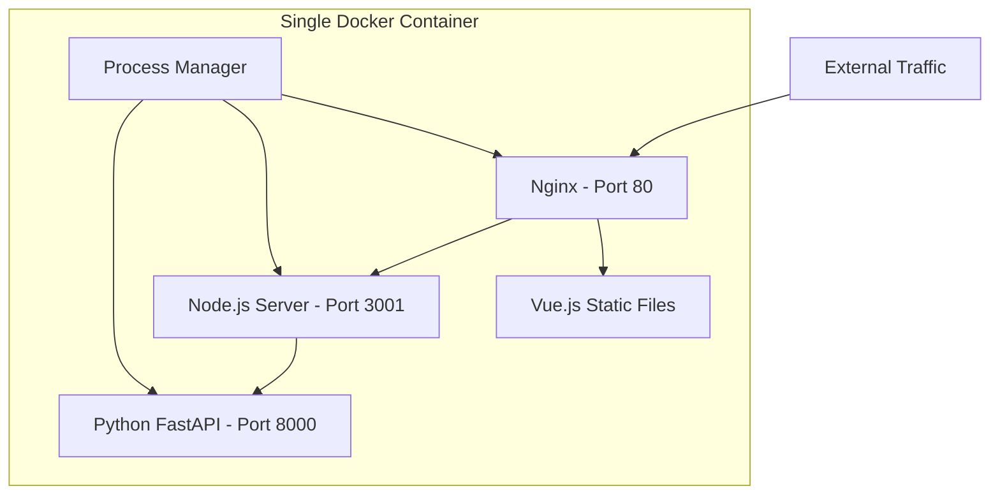
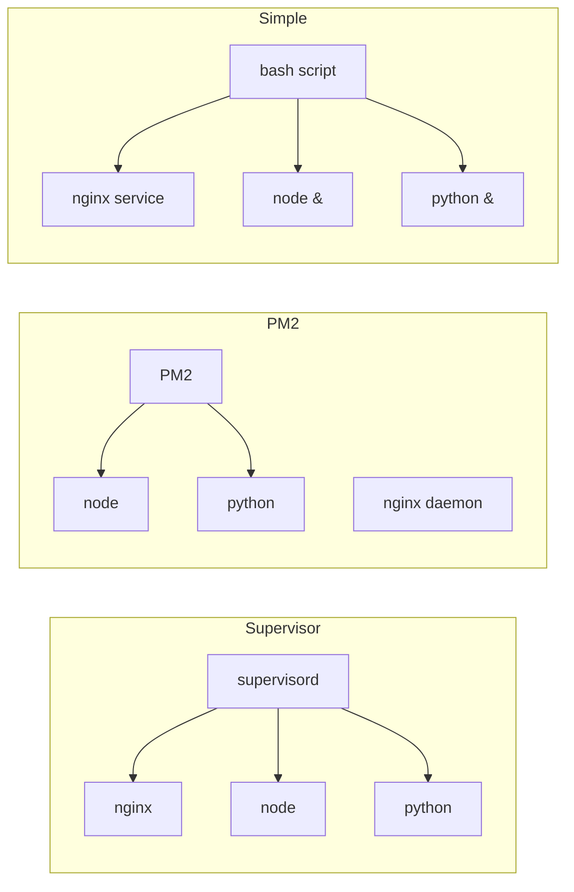

# All-in-One Docker Deployment

This document describes three different approaches to deploying all services (Vue.js frontend, Node.js server, Python backend) in a single Docker container.

## Overview



## Option 1: Supervisor-based (Production Ready)

**File**: `Dockerfile.all-in-one`

### Features
- Uses Supervisor for process management
- Proper logging for each service
- Automatic restart on failure
- Production-grade nginx configuration

### Build and Run
```bash
docker build -f Dockerfile.all-in-one -t dashboard-all .
docker run -p 80:80 dashboard-all
```

### Logs
```bash
# View all logs
docker exec -it <container_id> tail -f /var/log/supervisor/*.log

# View specific service logs
docker exec -it <container_id> tail -f /var/log/supervisor/nodejs.log
```

## Option 2: PM2-based (Node.js Friendly)

**File**: `Dockerfile.pm2`

### Features
- Uses PM2 for process management
- Lightweight Alpine Linux base
- Good for Node.js-centric deployments
- Built-in process monitoring

### Build and Run
```bash
docker build -f Dockerfile.pm2 -t dashboard-pm2 .
docker run -p 80:80 dashboard-pm2
```

### PM2 Commands
```bash
# List all processes
docker exec -it <container_id> pm2 list

# View logs
docker exec -it <container_id> pm2 logs

# Restart a service
docker exec -it <container_id> pm2 restart nodejs
```

## Option 3: Simple Shell Script (Development/Testing)

**File**: `Dockerfile.simple`

### Features
- Simplest approach
- Uses bash script for process management
- Good for development and testing
- Easy to understand and modify

### Build and Run
```bash
docker build -f Dockerfile.simple -t dashboard-simple .
docker run -p 80:80 dashboard-simple
```

## Architecture Comparison



## Pros and Cons

### Supervisor Approach
**Pros:**
- Industry standard for multi-process containers
- Excellent logging and monitoring
- Automatic restart with backoff
- Web UI available (optional)

**Cons:**
- Larger image size
- More complex configuration
- Python-based (adds overhead)

### PM2 Approach
**Pros:**
- Native to Node.js ecosystem
- Built-in clustering support
- Good monitoring features
- Smaller image with Alpine

**Cons:**
- Less ideal for non-Node processes
- Requires Node.js runtime

### Simple Script Approach
**Pros:**
- Easiest to understand
- Minimal overhead
- Quick to modify
- Good for development

**Cons:**
- Basic process management
- Limited restart capabilities
- Manual signal handling

## When to Use Each

### Use Supervisor when:
- Deploying to production
- Need robust process management
- Want detailed logging
- Running many services

### Use PM2 when:
- Node.js is your primary stack
- Want built-in monitoring
- Need clustering support
- Prefer JavaScript ecosystem

### Use Simple Script when:
- Development/testing only
- Learning Docker
- Quick prototypes
- Debugging issues

## Environment Variables

All approaches support environment variables:

```bash
# Run with custom environment
docker run -p 80:80 \
  -e NODE_ENV=production \
  -e FASTAPI_URL=http://localhost:8000 \
  -e PORT=3001 \
  dashboard-all
```

## Health Checks

Add health checks to your Docker run:

```bash
docker run -p 80:80 \
  --health-cmd="curl -f http://localhost/health || exit 1" \
  --health-interval=30s \
  --health-timeout=3s \
  --health-retries=3 \
  dashboard-all
```

## Debugging

### Enter the container
```bash
docker exec -it <container_id> /bin/bash
```

### Check process status
```bash
# Supervisor
docker exec -it <container_id> supervisorctl status

# PM2
docker exec -it <container_id> pm2 status

# Simple
docker exec -it <container_id> ps aux
```

### Test services internally
```bash
# Test FastAPI
docker exec -it <container_id> curl http://localhost:8000/

# Test Node.js
docker exec -it <container_id> curl http://localhost:3001/health

# Test Nginx
docker exec -it <container_id> curl http://localhost/
```

## Security Considerations

1. **Don't use in production without:**
   - Proper secrets management
   - Non-root user configuration
   - Security scanning
   - Network isolation

2. **Add security layers:**
   ```dockerfile
   # Run as non-root user
   RUN adduser -D appuser
   USER appuser
   ```

3. **Scan for vulnerabilities:**
   ```bash
   docker scan dashboard-all
   ```

## Performance Tuning

### Nginx Optimization
- Adjust worker processes
- Enable caching
- Tune buffer sizes

### Node.js Optimization
- Use cluster mode in PM2
- Set appropriate memory limits
- Enable production optimizations

### Python Optimization
- Use multiple Uvicorn workers
- Enable async processing
- Implement caching

## Monitoring

Consider adding monitoring:
- Prometheus metrics endpoint
- Health check endpoints
- Log aggregation
- Performance metrics

## Conclusion

Choose the approach that best fits your needs:
- **Production**: Use Supervisor-based approach
- **Development**: Use Simple script approach
- **Node.js focus**: Use PM2-based approach

All approaches provide a working all-in-one container, but differ in complexity and features.