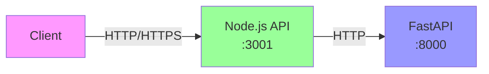
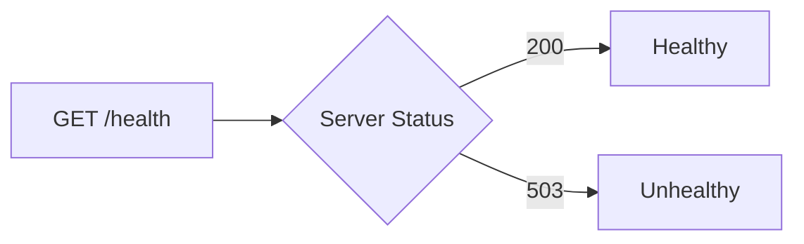
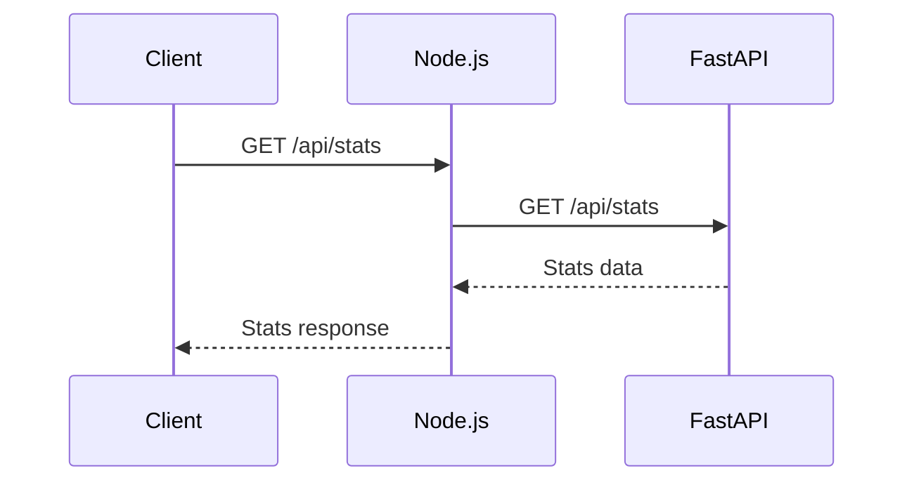
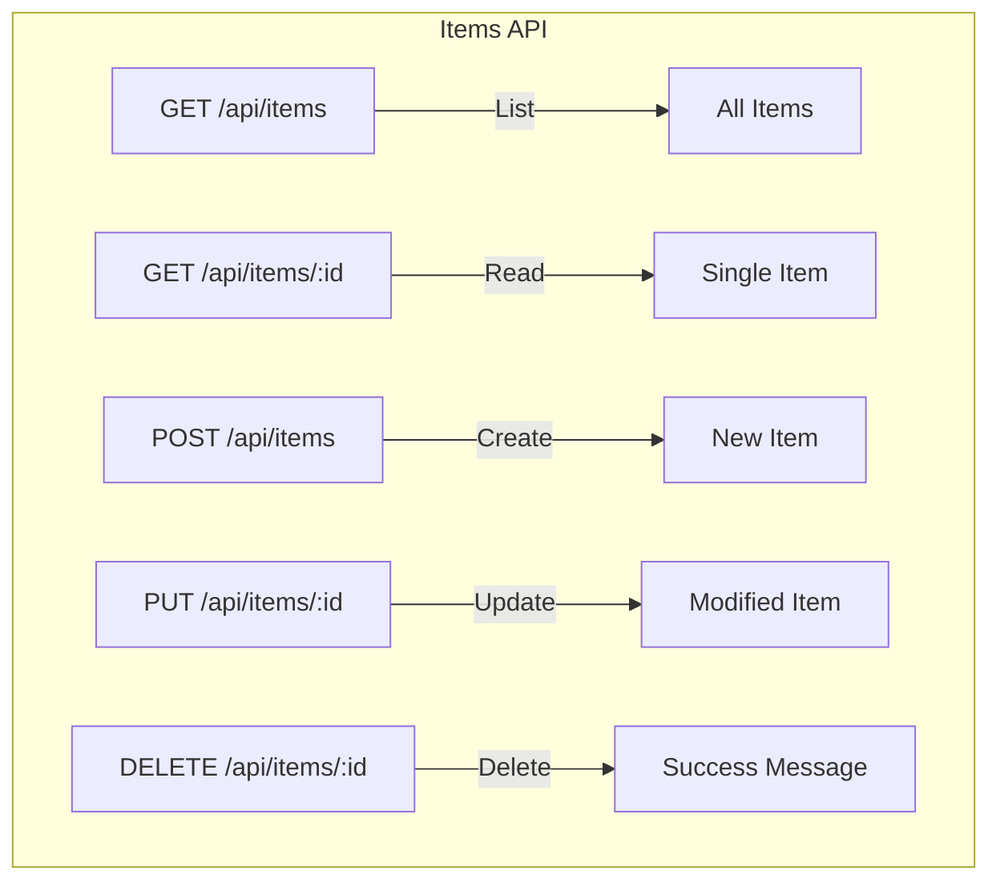
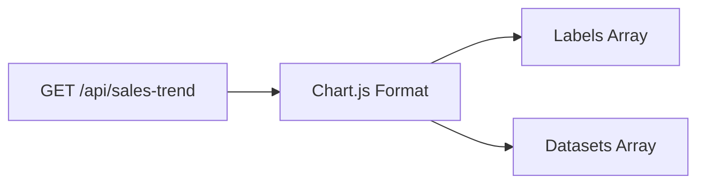
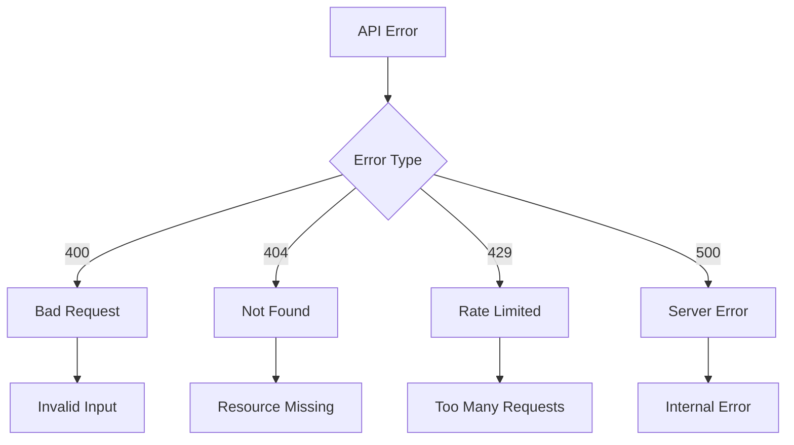
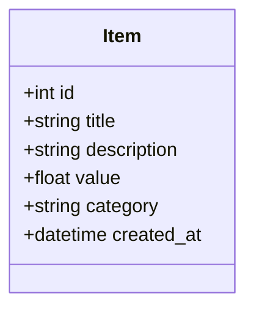
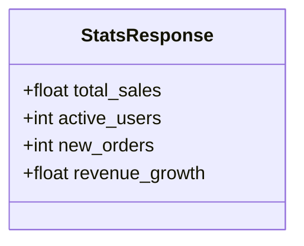
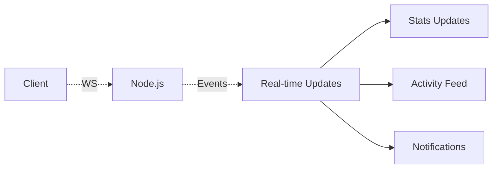

# API Documentation

## API Overview

The dashboard application provides a RESTful API through a Node.js middleware server that proxies requests to a Python FastAPI backend.



## Base URLs

- **Development**: `http://localhost:3001`
- **Production**: Configure based on deployment

## Authentication

Currently, the API does not require authentication. Future versions will implement JWT-based authentication.

## Common Headers

```http
Content-Type: application/json
Accept: application/json
```

## Rate Limiting

API requests are rate-limited to prevent abuse:
- **Window**: 15 minutes
- **Max Requests**: 100 per IP address

## API Endpoints

### Health Check



#### `GET /health`

Check the health status of the Node.js server.

**Response Example:**
```json
{
  "status": "healthy",
  "timestamp": "2024-01-15T10:30:00.000Z"
}
```

### Statistics

#### `GET /api/stats`

Retrieve dashboard statistics including sales, users, and revenue data.



**Response Example:**
```json
{
  "total_sales": 48596.00,
  "active_users": 1529,
  "new_orders": 324,
  "revenue_growth": 12.5
}
```

### Items Management



#### `GET /api/items`

Retrieve all items.

**Response Example:**
```json
[
  {
    "id": 1,
    "title": "Product A",
    "description": "High quality product",
    "value": 99.99,
    "category": "Electronics",
    "created_at": "2024-01-15T10:00:00.000Z"
  }
]
```

#### `GET /api/items/:id`

Retrieve a specific item by ID.

**Parameters:**
- `id` (path) - Item ID

**Response Example:**
```json
{
  "id": 1,
  "title": "Product A",
  "description": "High quality product",
  "value": 99.99,
  "category": "Electronics",
  "created_at": "2024-01-15T10:00:00.000Z"
}
```

**Error Response (404):**
```json
{
  "error": "Failed to fetch item",
  "message": "Item not found"
}
```

#### `POST /api/items`

Create a new item.

**Request Body:**
```json
{
  "title": "New Product",
  "description": "Product description",
  "value": 149.99,
  "category": "Electronics"
}
```

**Response Example (201):**
```json
{
  "id": 4,
  "title": "New Product",
  "description": "Product description",
  "value": 149.99,
  "category": "Electronics",
  "created_at": "2024-01-15T11:00:00.000Z"
}
```

#### `PUT /api/items/:id`

Update an existing item.

**Parameters:**
- `id` (path) - Item ID

**Request Body:**
```json
{
  "title": "Updated Product",
  "description": "Updated description",
  "value": 199.99,
  "category": "Electronics"
}
```

**Response Example:**
```json
{
  "id": 1,
  "title": "Updated Product",
  "description": "Updated description",
  "value": 199.99,
  "category": "Electronics",
  "created_at": "2024-01-15T10:00:00.000Z"
}
```

#### `DELETE /api/items/:id`

Delete an item.

**Parameters:**
- `id` (path) - Item ID

**Response Example:**
```json
{
  "message": "Item deleted successfully"
}
```

### Dashboard Data

#### `GET /api/sales-trend`

Retrieve sales trend data for charts.



**Response Example:**
```json
{
  "labels": ["Jan", "Feb", "Mar", "Apr", "May", "Jun"],
  "datasets": [
    {
      "label": "Sales",
      "data": [12000, 19000, 15000, 25000, 22000, 30000],
      "borderColor": "#10b981",
      "backgroundColor": "rgba(16, 185, 129, 0.1)"
    }
  ]
}
```

#### `GET /api/recent-activity`

Retrieve recent activity logs.

**Response Example:**
```json
[
  {
    "id": 1,
    "user": "John Doe",
    "action": "Created new order #1234",
    "timestamp": "2024-01-15T10:55:00.000Z"
  },
  {
    "id": 2,
    "user": "Jane Smith",
    "action": "Updated product inventory",
    "timestamp": "2024-01-15T10:45:00.000Z"
  }
]
```

## Error Handling



### Error Response Format

All errors follow a consistent format:

```json
{
  "error": "Error title",
  "message": "Detailed error message"
}
```

### Common Error Codes

| Status Code | Description | Example |
|-------------|-------------|---------|
| 400 | Bad Request | Invalid request body |
| 404 | Not Found | Item or resource not found |
| 429 | Too Many Requests | Rate limit exceeded |
| 500 | Internal Server Error | Server processing error |
| 503 | Service Unavailable | Backend service down |

## Data Models

### Item Model



### Stats Model



## Request Examples

### Using cURL

```bash
# Get all items
curl -X GET http://localhost:3001/api/items

# Create new item
curl -X POST http://localhost:3001/api/items \
  -H "Content-Type: application/json" \
  -d '{
    "title": "New Product",
    "description": "Description",
    "value": 99.99,
    "category": "Electronics"
  }'

# Update item
curl -X PUT http://localhost:3001/api/items/1 \
  -H "Content-Type: application/json" \
  -d '{
    "title": "Updated Product",
    "description": "New description",
    "value": 149.99,
    "category": "Electronics"
  }'

# Delete item
curl -X DELETE http://localhost:3001/api/items/1
```

### Using JavaScript (Fetch API)

```javascript
// Get stats
const response = await fetch('http://localhost:3001/api/stats');
const stats = await response.json();

// Create item
const newItem = await fetch('http://localhost:3001/api/items', {
  method: 'POST',
  headers: {
    'Content-Type': 'application/json',
  },
  body: JSON.stringify({
    title: 'New Product',
    description: 'Description',
    value: 99.99,
    category: 'Electronics'
  })
});
```

## API Versioning

Currently, the API is at version 1.0. Future versions will implement versioning through:
- URL path versioning (e.g., `/api/v2/items`)
- Header-based versioning

## WebSocket Support (Future)

Future versions will support WebSocket connections for real-time updates:

