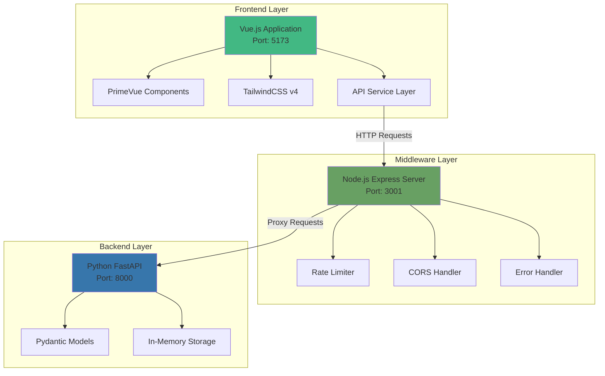
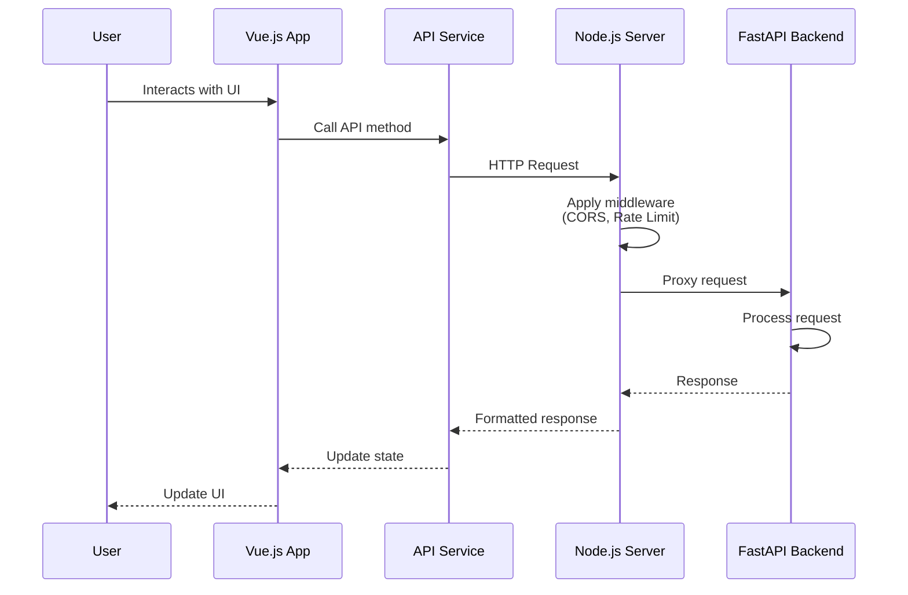
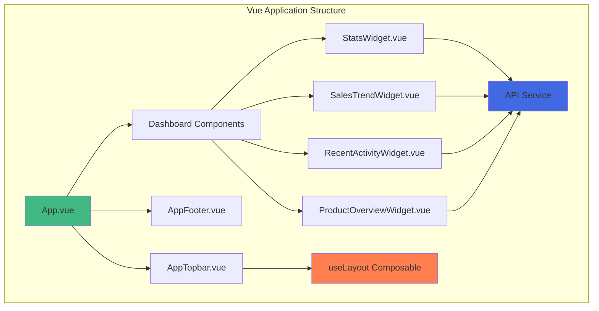
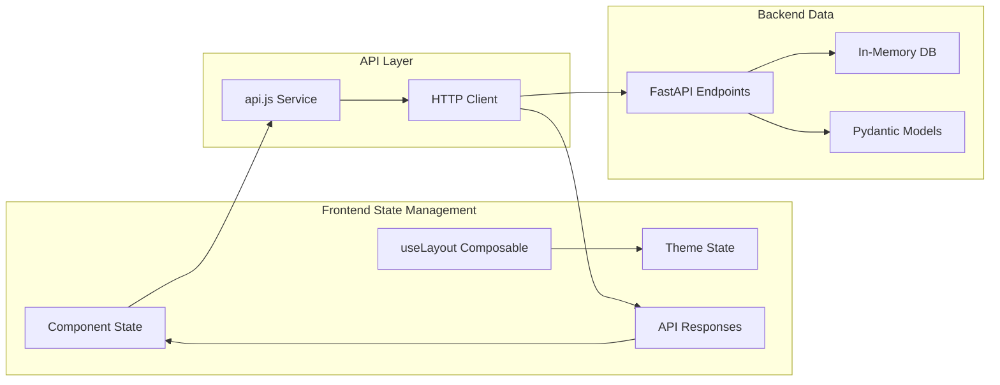
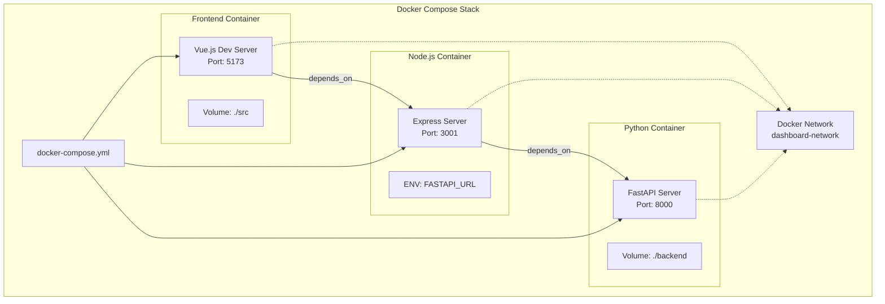
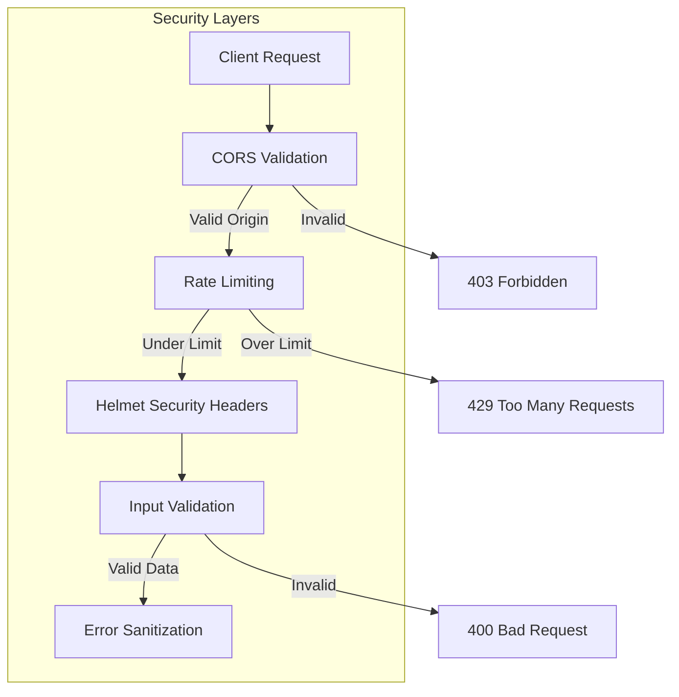
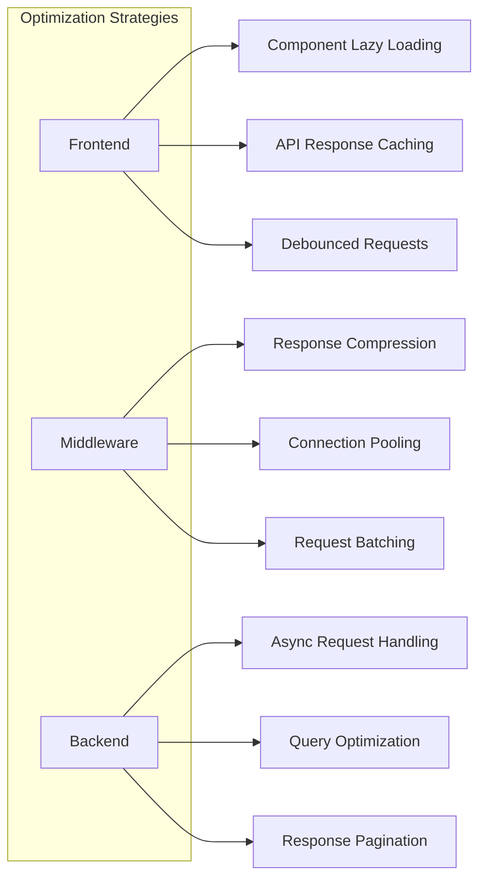
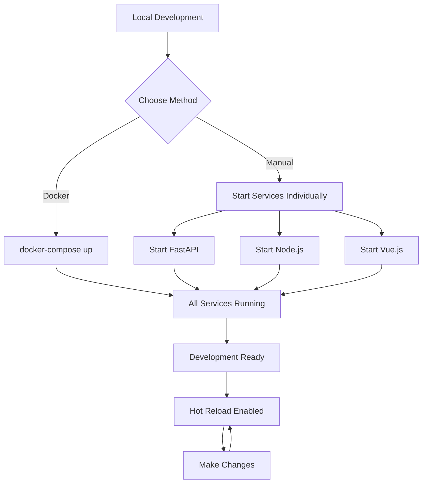

# Dashboard Application Architecture

## Overview

This document describes the architecture of the full-stack dashboard application built with Vue.js, Node.js, and Python FastAPI.

## System Architecture



## Request Flow



## Component Architecture



## Data Flow Architecture



## API Endpoints Structure

```mermaid
graph TD
    subgraph "Node.js API Routes"
        A[/health]
        B[/api/stats]
        C[/api/items]
        D[/api/items/:id]
        E[/api/sales-trend]
        F[/api/recent-activity]
    end
    
    subgraph "FastAPI Routes"
        G[GET /api/stats]
        H[GET /api/items]
        I[POST /api/items]
        J[GET /api/items/{id}]
        K[PUT /api/items/{id}]
        L[DELETE /api/items/{id}]
    end
    
    B -.->|Proxy| G
    C -.->|Proxy| H
    C -.->|Proxy| I
    D -.->|Proxy| J
    D -.->|Proxy| K
    D -.->|Proxy| L
    
    style A fill:#90ee90
    style E fill:#87ceeb
    style F fill:#87ceeb
```

## Deployment Architecture



## Security Architecture



## Technology Stack Details

### Frontend Layer
- **Vue.js 3**: Reactive UI framework with Composition API
- **PrimeVue 4**: Comprehensive UI component library
- **TailwindCSS v4**: Utility-first CSS framework
- **Chart.js**: Data visualization library
- **Vite**: Build tool and dev server

### Middleware Layer
- **Express.js**: Web application framework
- **Axios**: HTTP client for backend communication
- **Helmet**: Security headers middleware
- **CORS**: Cross-origin resource sharing
- **Express Rate Limit**: Rate limiting middleware
- **Morgan**: HTTP request logger

### Backend Layer
- **FastAPI**: Modern Python web framework
- **Pydantic**: Data validation using Python type annotations
- **Uvicorn**: ASGI server implementation
- **Python 3.11**: Programming language

## Key Design Patterns

### 1. **API Gateway Pattern**
The Node.js server acts as an API gateway, providing:
- Single entry point for frontend
- Request routing and aggregation
- Cross-cutting concerns (auth, logging, rate limiting)

### 2. **Composition Pattern**
Vue.js components use the Composition API for:
- Reusable logic extraction
- Better TypeScript support
- Cleaner component organization

### 3. **Repository Pattern**
FastAPI uses in-memory storage abstraction:
- Separation of data access logic
- Easy to swap with real database
- Consistent data operations

### 4. **DTO Pattern**
Pydantic models serve as Data Transfer Objects:
- Type validation
- Serialization/deserialization
- API documentation generation

## Performance Considerations



## Development Workflow



## Future Enhancements

1. **Authentication & Authorization**
   - JWT token implementation
   - Role-based access control
   - Session management

2. **Database Integration**
   - PostgreSQL for production
   - Redis for caching
   - Database migrations

3. **Monitoring & Logging**
   - OpenTelemetry integration
   - Centralized logging
   - Performance metrics

4. **Scalability**
   - Kubernetes deployment
   - Load balancing
   - Microservices architecture

5. **Testing**
   - Unit tests for all layers
   - Integration tests
   - E2E tests with Cypress