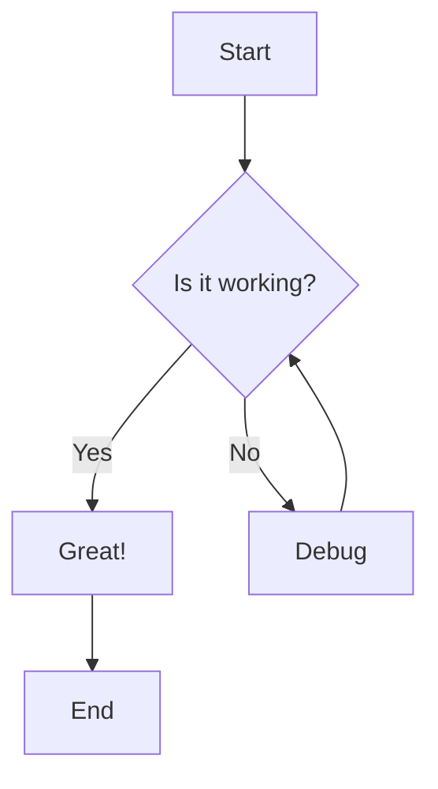
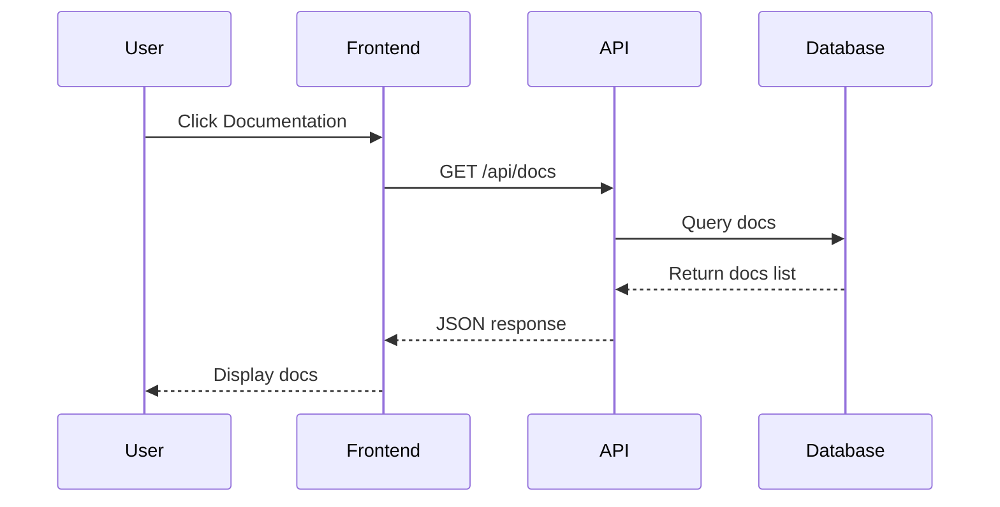
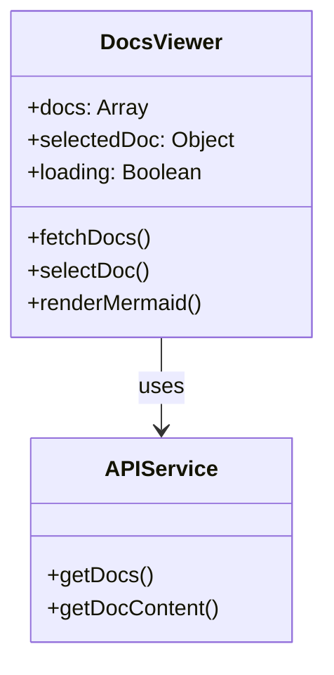
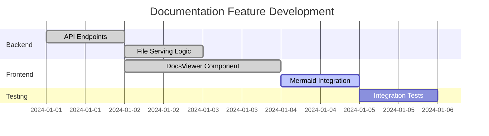
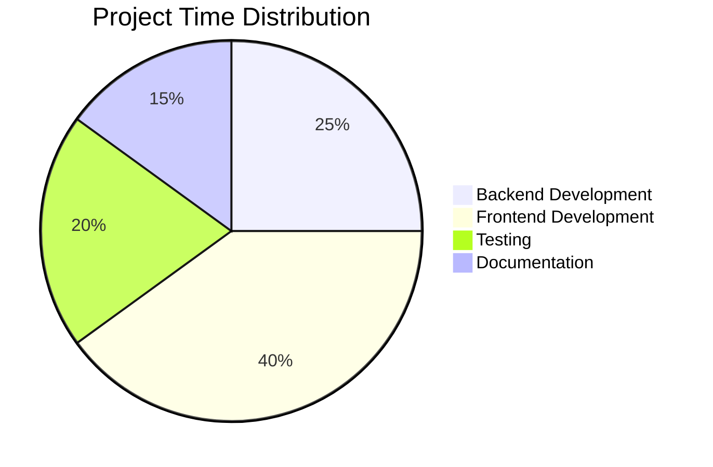
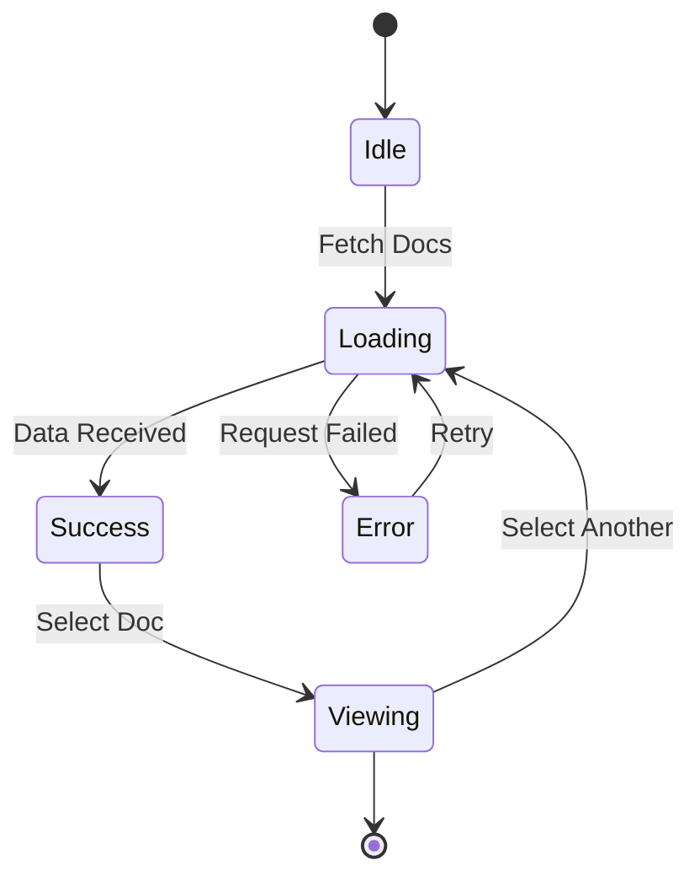

# Mermaid Diagram Test

This document contains various Mermaid diagrams to test the rendering functionality.

## Flow Chart



## Sequence Diagram



## Class Diagram



## Gantt Chart



## Pie Chart



## Regular Text

This is regular markdown text that should render normally, not as a diagram.

### Code Block (Non-Mermaid)

```javascript
// This is a regular code block
function hello() {
    console.log("Hello, World!");
}
```

## State Diagram



This concludes the mermaid diagram test document.