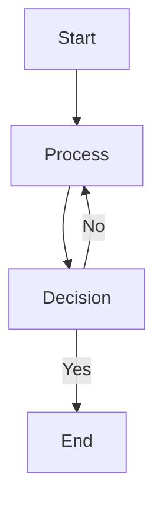
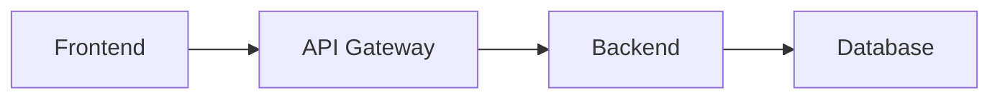

# Simple Mermaid Test

Testing mermaid diagram rendering.

## Simple Flow Chart



## Code Block Test

Here's a regular code block to test syntax highlighting:

```javascript
function calculateSum(a, b) {
    return a + b;
}

const result = calculateSum(5, 3);
console.log("The sum is:", result);
```

Another code example:

```python
def greet(name):
    """Simple greeting function"""
    return f"Hello, {name}!"

# Call the function
message = greet("World")
print(message)
```

## Another Mermaid Diagram



That's all for this test!